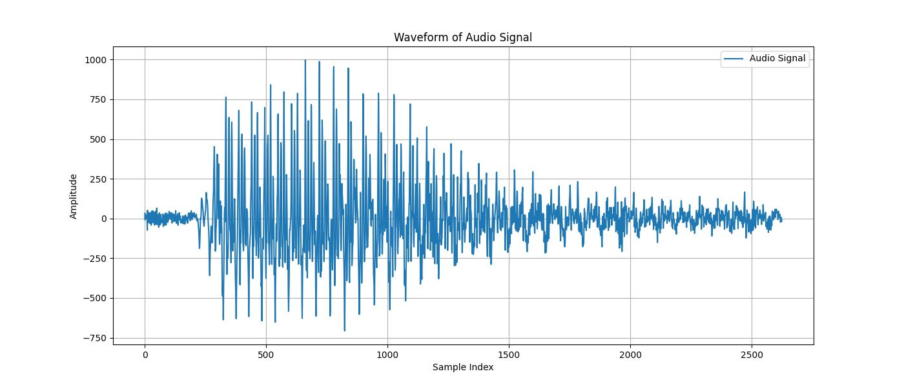
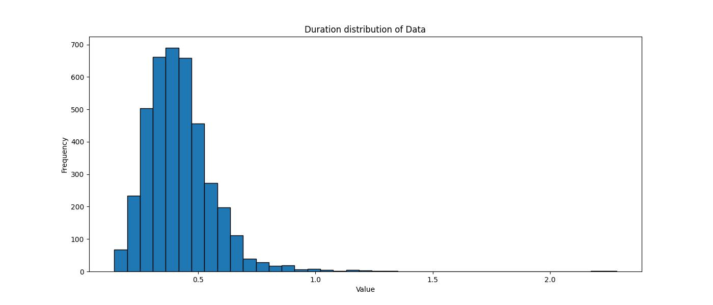
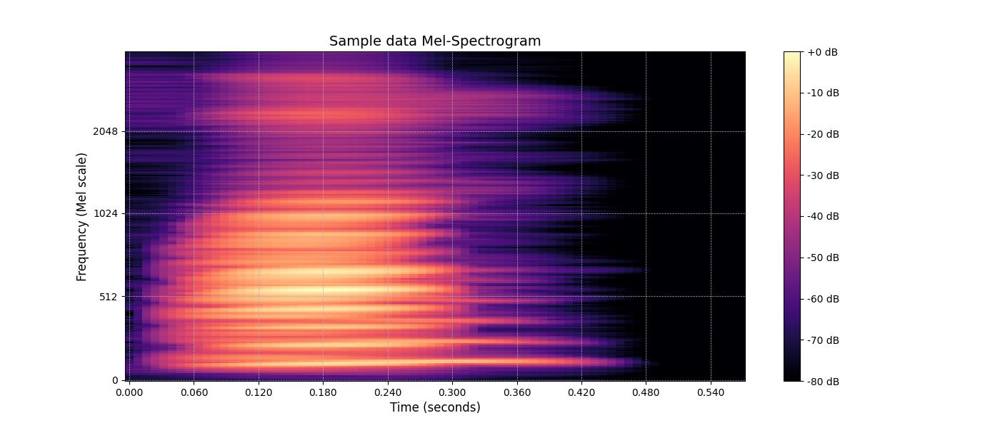
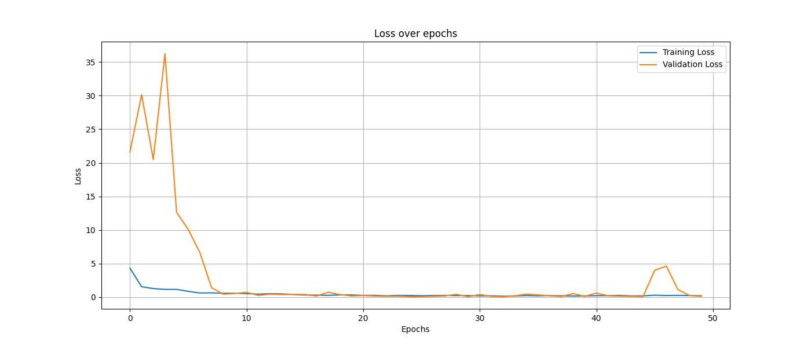
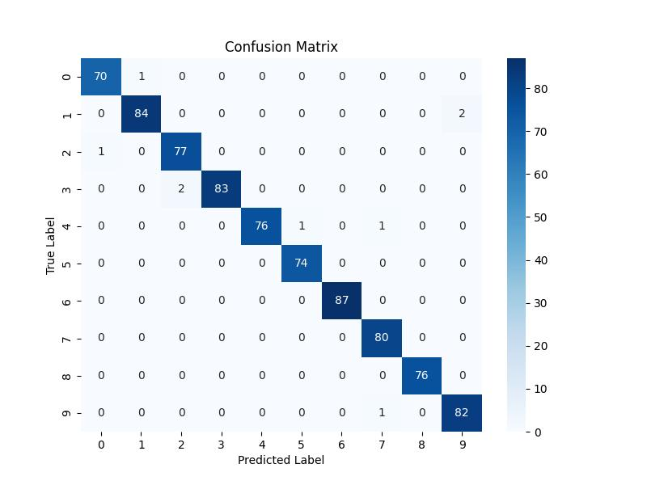

# Speech Digit Classification

## Overview
This project focuses on classifying spoken digits (0-9) using audio recordings. The dataset consists of preprocessed speech samples that are transformed into Mel-Spectrogram representations. A Convolutional Neural Network (CNN) model is trained on these spectrograms to achieve high classification accuracy.

## Dataset
The dataset is based on the **Free Spoken Digit Dataset (FSDD)**, which contains around 4,000 recordings of digits spoken by different speakers. Each recording is a `.wav` file sampled at 8kHz.

### Dataset Structure:
- `free-spoken-digit/` - Contains labeled audio recordings (`<id>_<label>.wav`)

## Project Workflow
1. **Loading Audio Data**: Extract waveform data from `.wav` files.
2. **Data Preprocessing**:
   - Convert stereo to mono (if necessary)
   - Normalize and truncate/pad audio to a fixed length
   - Extract Mel-Spectrogram features
3. **Model Development**:
   - Construct a CNN-based model with convolutional layers
   - Train and validate the model using the preprocessed dataset
4. **Evaluation**:
   - Assess model accuracy and loss on test data
5. **Deployment**:
   - Save the trained model for future inference

### Time-Domain Representation of an Audio Signal


### Histogram of Audio Clip Durations


### Mel-Spectrogram Visualization of a Speech Sample



## Model Architecture
The classification model is a **Convolutional Neural Network (CNN)** with the following structure:
- **Conv2D layers** for feature extraction
- **Batch Normalization** for stable training
- **MaxPooling2D layers** for down-sampling
- **Flatten layer** for converting feature maps into a dense representation
- **Dense layers** for classification
- **Dropout** for regularization

### Model Performance
- **Validation Accuracy**: ~98%
- **Test Accuracy**: ~97%

### Results
#### Training and Validation Loss Over 50 Epochs


#### Confusion Matrix of Speech Digit Classification


#### Classification Report
| Digit | Precision | Recall | F1-Score | Support |
|-------|-----------|--------|----------|---------|
| 0     | 0.99      | 0.99   | 0.99     | 71      |
| 1     | 0.99      | 1.00   | 0.99     | 86      |
| 2     | 0.96      | 0.97   | 0.97     | 78      |
| 3     | 0.99      | 0.96   | 0.98     | 85      |
| 4     | 1.00      | 1.00   | 1.00     | 78      |
| 5     | 0.99      | 1.00   | 0.99     | 74      |
| 6     | 1.00      | 0.98   | 0.99     | 87      |
| 7     | 1.00      | 1.00   | 1.00     | 80      |
| 8     | 0.97      | 1.00   | 0.99     | 76      |
| 9     | 1.00      | 0.99   | 0.99     | 83      |
| **Accuracy** | **-** | **-** | **0.99** | **798** |
| **Macro Avg** | **0.99** | **0.99** | **0.99** | **798** |
| **Weighted Avg** | **0.99** | **0.99** | **0.99** | **798** |


## Installation
To set up the project, install the required dependencies:

```bash
pip install -r requirements.txt
```

### Evaluating the Model
To evaluate the trained model, run:
```bash
python evaluate.py
```

## Requirements
See `requirements.txt` for the full list of dependencies.

## Loading the Model
The model is saved as `cnn_speech_digit_classifier.h5`. It can be loaded for further predictions or fine-tuning.

```python
from tensorflow.keras.models import load_model
model = load_model("cnn_speech_digit_classifier.h5")
```

## References
- [Free Spoken Digit Dataset](https://github.com/Jakobovski/free-spoken-digit-dataset)
- [Librosa Documentation](https://librosa.org/doc/latest/index.html)
- [TensorFlow Keras Documentation](https://www.tensorflow.org/api_docs/python/tf/keras)

